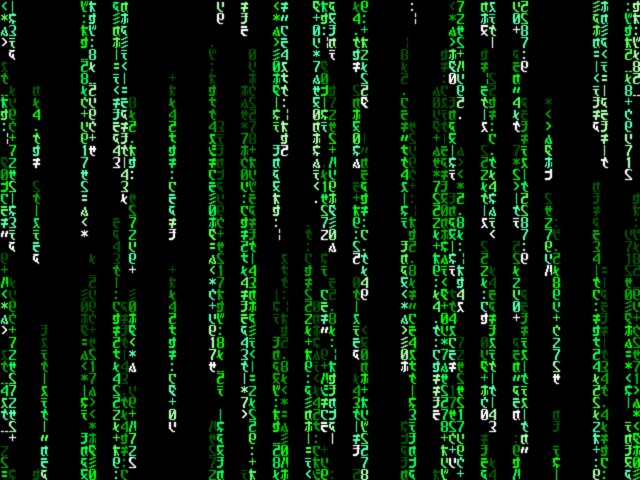

   

# Tiny Tapeout VGA Glyph Mode

This began as an entry into the Tiny Tapeout 08 Demoscene competition.  A
couple improvements were made since that time.  The name is a play on the VGA
Text Mode, but this project uses glyphs seen in [The Matrix Digital
Rain](https://www.youtube.com/watch?v=SneR61OG4ZI) -- a brilliant effect from
the best science fiction movie since 1999.

- [Read the documentation for project](docs/info.md)

## What is Tiny Tapeout?

Tiny Tapeout is an educational project that aims to make it easier and cheaper than ever to get your digital and analog designs manufactured on a real chip.

To learn more and get started, visit https://tinytapeout.com.
