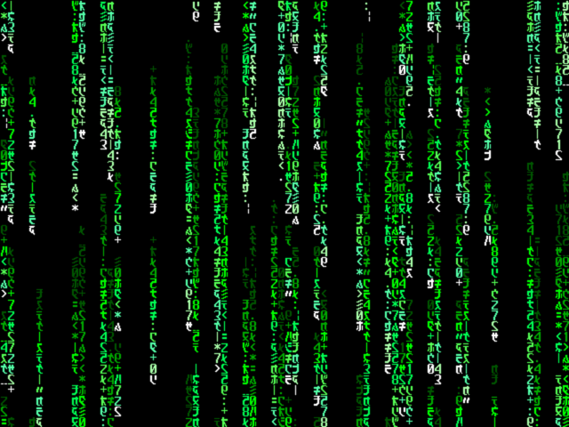

## How it Works

This is a standalone VGA demo that runs with or without input, replicating *The
Matrix* Digital Rain effect.

Upon circuit reset, the glyphs will appear to fall from the top of the screen.

You can change the palette with the two pins, `ui_io[0]` and `ui_io[1]`.

**NOTE** The default VGA timing requires a pixel clock of 25.175 MHz. If you
want to drive higher resolutions, the base clock rate must be adjusted
accordingly with the Clocks table below. You must also set the two pins,
`ui_io[6]` and `ui_io[7]`, to select your preferred mode.

## How to Test

Plug into a VGA monitor and select this circuit to test. By default, the
circuit must be clocked at (or very near) to **25.175 MHz**. There are four VGA
timing modes, representing four different display resolutions, which must be
both specifically clocked *and* have the pins `ui_io[7:6]` set according to the
following table.

### Clocks

**Pins 6 and 7 paired with pixel clock**

| `ui_io[7:6]` | Clock (MHz) | VGA Timing Mode     |
|-------------:|:------------|--------------------:|
|  (default) 0 | 25.175      |  640 x 480 @ 60 fps |
|            1 | 34.96       |  768 x 576 @ 60 fps |
|            2 | 40.0        |  800 x 600 @ 60 fps |
|            3 | 65.0        | 1024 x 768 @ 60 fps |

### Additional Palette Input

The circuit accepts two pins `ui_io[0]` and `ui_io[1]` for palette selection:

| `ui_io[1:0]` | Palette |
|-------------:|:--------|
|  (default) 0 | Green   |
|            1 | Red     |
|            2 | Blue    |
|            3 | Pride   |

## External hardware

Requires the [TinyVGA PMOD](https://github.com/mole99/tiny-vga)
